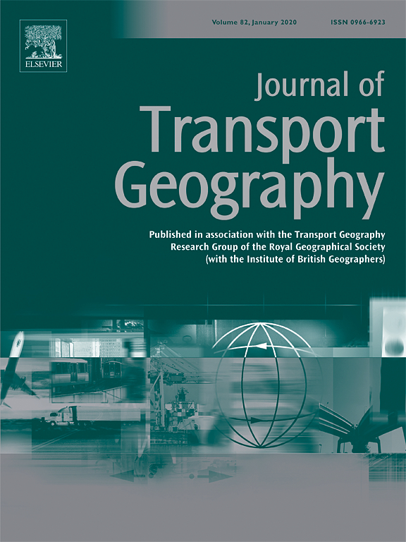

This repo constains part of the code used in the data analysis and visualzation used in the paper:
- Ryan, J., Pereira, R. H. M., & Andersson, M. (2023). **Accessibility and space-time differences in when and how different groups (choose to) travel*. *Journal of Transport Geography*, 111, 103665. [https://doi.org/10.1016/j.jtrangeo.2023.103665](https://doi.org/10.1016/j.jtrangeo.2023.103665)
